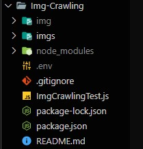

# Img-Crawling

 
<h3>구글 이미지 크롤링</h3>

# Stack

<h3>node.js</h3>

# Folder Structure

# API

<h3>Custom Search API</h3>

# 사용방법

<pre> git clone을 사용하여 repository를 복사하고 img 폴더를 생성한다. 
npm install 을 사용하여 모듈 설치를 하였으면 ImgCrawlingTest.js 의 keyWord 에 
본인이 원하는 단어를 작성 후 node ImgCrawlingTest.js 를 사용하여 실행한다.
크롤링하여 가져온 이미지의 폴더는 img 폴더 안에 만들어지고 zip 파일은 img 하위에 만들어진다.</pre>
